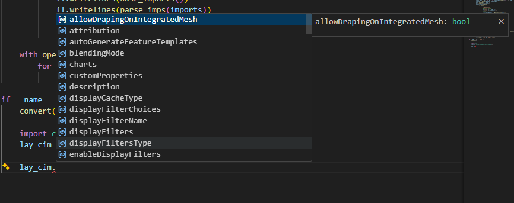
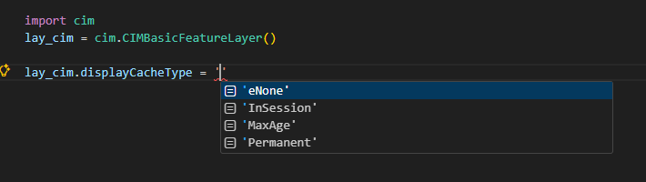
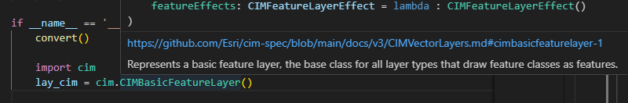
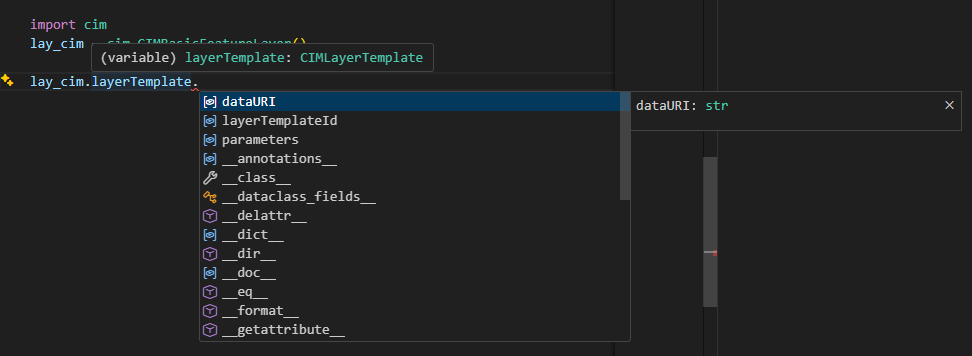

# cimple
A conversion script that takes `arcpy.cim` and re-writes it using dataclasses and string literals

# Usage
1) Clone the repo and run the `build_cim` function in the cimple module
2) a `cim` directory will be generated that contains typed CIM definitions
3) When writing code, you can use this generated module and switch to regular cim at runtime:
```python 
    if TYPE_CHECKING:
        from cimple import cim
```
4) Once the `cimple.cim` module is imported, you'll have access to all CIM objects on the root:
```python
l_cim: cim.CIMVectorLayer = layer.getDefinition('V3')
# All flags and attributes are exposed to type checker now
```

# Caveats
In order to make usage simpler, Enumerations were replaced with type literals. This means that autocompletion will five you all available string options, but you need to validate the enumeration mapping. All these are available in the `literals` submodule.

## NOTE
Due to usage and licensing of the `arcpy.cim` module, I cannot include it in this repo. You will need to run this script in an environment with access to `arcpy.cim`

# Additional Info
An attempt was made to include links to the [CIM github](https://github.com/Esri/cim-spec/tree/main/docs/v3) by interpolating classname and module name into the URL. This link will be the first line of the `__doc__` for every CIM class

# Contribution
I will gladly accept any contributions, Please submit a PR and I will review. As of now this script is very barebones and mostly used to investigate the benefits of flattening the CIM hierarchy and utilizing dataclasses.

# Screenshots
### Attribute completion


### Literal Completion


### Inline Documentation


### Nested Autocompletion
